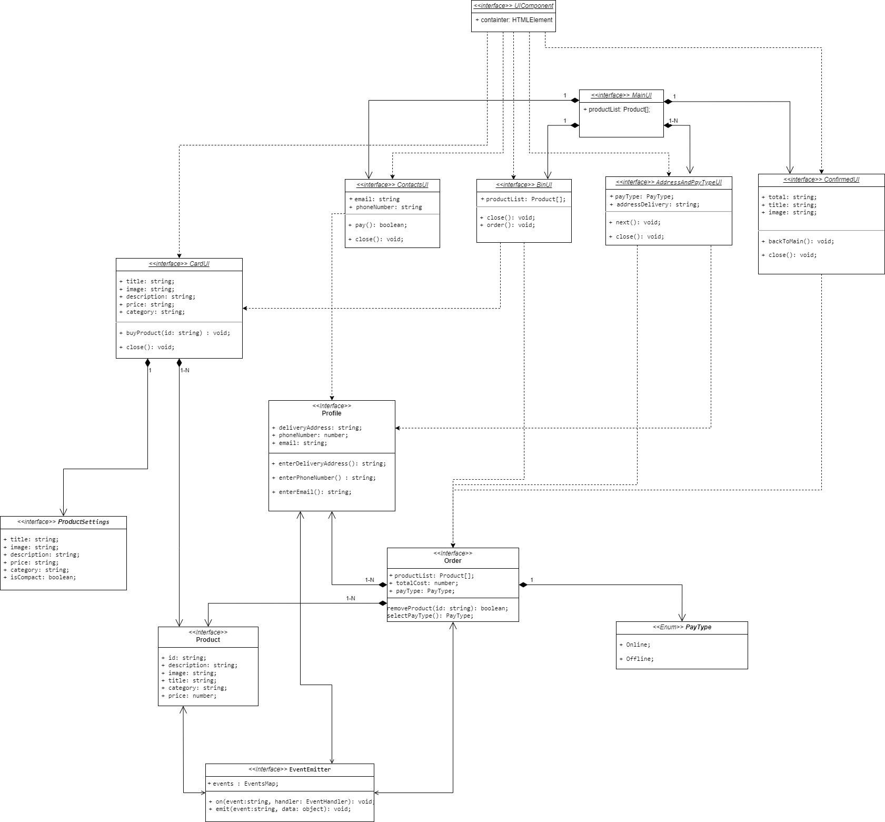

# Проектная работа "Веб-ларек"

Стек: HTML, SCSS, TS, Webpack

Структура проекта:
- src/ — исходные файлы проекта
- src/components/ — папка с компонентами модели
- src/components/view/ — папка с View компонентами
- src/components/base/ — папка с базовым кодом
- src/types/ — папка с типами

Важные файлы:
- src/pages/index.html — HTML-файл главной страницы
- src/index.ts — точка входа приложения
- src/styles/styles.scss — корневой файл стилей
- src/utils/constants.ts — файл с константами
- src/utils/utils.ts — файл с утилитами

## Установка и запуск
Для установки и запуска проекта необходимо выполнить команды

```
npm install
npm run start
```

или

```
yarn
yarn start
```
## Сборка

```
npm run build
```

или

```
yarn build
```
## Архитектура



## Базовый код
Архитектура проекта реализована через централизованный брокер событий IEvents.
### Класс EventEmitter
Реализует паттерн «Наблюдатель» и позволяет подписываться на события и уведомлять подписчиков
о наступлении события.
Класс имеет методы on, emit — для подписки на событие и уведомления
подписчиков о наступлении события соответственно.
Список событий для подписки и уведомления:
 * ``openCard(): Product`` - открыть карточку Продукта,
 * ``openBasket(): Product[]`` - открыть корзину пользователя,
 * ``closePopup(): void`` - закрыть модальное окно,
 * ``removeProduct(): Product`` - удалить продукт из корзины,
 * ``addProductToBasket(): Product`` - добавить продукт в корзину,
 * ``choosePayType(): PayType`` - указать тип оплаты,
 * ``addAddressDelivery(): string`` - указать адрес доставки,
 * ``addPhoneNumber(): string`` - указать телефон покупателя,
 * ``addEmail(): string`` - указать электронный адрес покупателя, 
 * ``pay(): boolean`` - оплатить заказ, 
 * ``goToMainPage(): void`` - перейти на главную страницу, 
 * ``order(): boolean``  - оформить заказ;

### Класс Modal
Описывает контейнер для модальных окон.
 * ``header?: H`` - проброс данных в текущее отображение,
 * ``content: C`` - Отображаемый контент,
 * ``message?: string`` - Установка сообщения в модальное окно,
 * ``isActive: boolean`` - Открытие и закрытие модального окна,
 * ``isError?: boolean`` - Проверка на ошибки;

## Компоненты модели данных (бизнес-логика)

### 1.Класс Product
Используется для описания сущности Продукта, который можно купить.  
 * ``id: string`` - Уникальный идентификатор,  
 * ``description: string`` - Описание продукта,  
 * ``image: string`` - Фотография продукта,  
 * ``title: string`` - Заголовок продукта,  
 * ``category: string`` - Категория продукта,  
 * ``price: number`` - Цена продукта;  
### 2. Класс Profile  
Описывает профиль пользователя, оформляющего заказ на покупку товара(ов)  
В качестве данных профиля пользователя используются:  
 * ``deliveryAddress: string`` - Адрес доставки,  
 * ``phoneNumber: number`` - Номер телефона пользователя,  
 * ``email: string`` - Электронный почтовый ящик пользователя;    

Описывает методы:  
 * ``enterDeliveryAddress() string`` - Ввести адрес доставки,  
 * ``enterPhoneNumber(): string`` - Указать номер телефона пользователя,  
 * ``enterEmail(): string`` - Указать электронный адрес пользователя;  

### 3. Класс Order  
Описывает заказ оформленный на портале.   
Связан с Классами Profile и Product.   
Содержит данные по пользователю, оформляющего заказ и данные по продуктам добавленные в корзину,  
 * ``productList: Product[]`` - Список продуктов,   
 * ``totalCost: number`` - Общая стоимость товаров в корзине,   
 * ``payType: PayType`` - Тип доставки;    

Описывает методы:  
 * ``removeProduct(id:string): boolean`` - Удалить добавленный продукт из заказа,  
 * ``selectPayType(type: PayType): void`` - Указать тип оплаты, при оформлении заказа; 

### 4. Enum PayType
Описывает варианты оплаты заказа:  
 * ``Online``
 * ``Offline``

## Компоненты представления

### 1. Класс MainUI
Отвечает за отображение главной веб-страницы
Содержит:
 * ``productList: Product[]`` - Список продуктов
### 2. Класс ContactsUI  
Отвечает за отображение поп-ап формы, где пользователю необходимо ввести свои контакты.  
Связано с данными Пользователя.  
Содержит:   
 * ``email: string`` - Емейл покупателя,  
 * ``phoneNumber: string`` - Номер телефона покупателя;  

Реализует методы:  
 *  ``pay(): boolean`` - Кнопка оплаты товара,  
 *  ``close(): void`` - Кнопка закрытия формы;  
### 3. Класс BasketUI  
Отвечает за отображение текущей корзины пользователя. Отображение связано с данными Продукта и Заказа  
Содержит:  
* ``productList: Product[]`` - Список продуктов,  
* ``phoneNumber: string`` - Номер телефона покупателя;  

Реализует методы:  
*  ``order(): void`` - Кнопка оплаты товара,  
*  ``close(): void`` - Кнопка закрытия формы;  
### 4. Класс AddressAndPayTypeUI  
Отвечает за отображение поп-ап формы, для заполнения адреса и выбора типа оплаты заказа.  
Связано с сущностью Заказа и Профилем пользователя.   
Содержит:
* ``payType: PayType`` - Тип оплаты: Онлайн/Офлайн,
* ``addressDelivery: string`` - Адрес доставки покупателя;

Реализует методы:
*  ``next(): void`` - Кнопка "Далее",
*  ``close(): void`` - Кнопка закрытия формы;
### 5. Класс ConfirmedUI  
Отвечает за отображение поп-ап формы успешного совершения заказа.     
Содержит:
* ``total: string`` - Общая стоимость товаров в корзине,
* ``title: string`` - Заголовок формы,
* ``image: string`` - Фотография формы, 

Реализует методы:
*  ``backToMain(): void`` - Кнопка "Назад на главное меню",
*  ``close(): void`` - Кнопка закрытия формы;
### 6. Класс CardUI  
Отвечает за отображение Карточки Продукта
Содержит:
* ``image: string`` - Изображение продукта,
* ``description: string`` - Описание продукта,  
* ``price: string`` - Цена продукта,    
* ``category: string`` - Категория продукта; 

Реализует методы:
*  ``buyProduct(id: string): void`` - Кнопка "Купить продукты",
*  ``close(): void`` - Кнопка закрытия формы;


